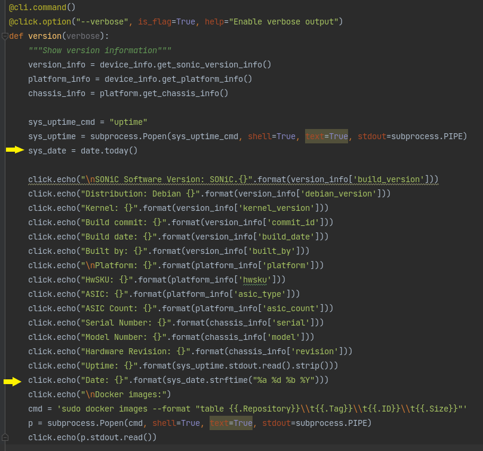
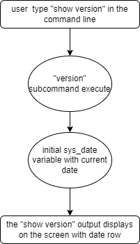

# HLD document to add date to "show version" CLI 


####  Rev 0.1


# Table of Contents

​	-[List of Figures](#list-of-figures)

​	-[Revision](#revision)

​	-[Motivation](#motivation)

​	-[About this Manual](#about-this-manual)

​	-[Design](#design)

​	-[CLI](#cli)

​	-[Flow](#flow)

​	-[Tests](#tests)

# List of Figures
* [flow diagram](#9-Flow)

# Revision
| Rev  |   Date   |    Author    | Change Description |
| :--: | :------: | :----------: | ------------------ |
| 0.1  | 02/22/22 | Eden Grisaro | Initial version    |


# Motivation

Execute "show techsupport" provides system logs but it doesnt contain the current date when the command is issued. Since "show version" is taken when running "show techsupport" command, adding "Date" attribute to "show version" command will assist with having the reference date. 


# About this Manual

This document provides an overview of the implementation to add a new "date" attribute which provides the <u>current</u> date of the switch when running the "show version" CLI command.


**<u>Before:</u>**

```
admin@sonic:~$ show version
SONiC Software Version: SONiC.HEAD.32-21ea29a
Distribution: Debian 9.8
Kernel: 4.9.0-8-amd64
Build commit: 21ea29a
Build date: Fri Mar 22 01:55:48 UTC 2019
Built by: johnar@jenkins-worker-4

Platform: x86_64-mlnx_msn2700-r0
HwSKU: Mellanox-SN2700
ASIC: mellanox
ASIC Count: 1
Serial Number: MT1822K07815
Model Number: MSN2700-CS2FO
Hardware Rev: A1
Uptime: 14:40:15 up 3 min,  1 user,  load average: 1.26, 1.45, 0.66
```

**<u>After:</u>**

```
admin@sonic:~$ show version
SONiC Software Version: SONiC.HEAD.32-21ea29a
Distribution: Debian 9.8
Kernel: 4.9.0-8-amd64
Build commit: 21ea29a
Build date: Fri Mar 22 01:55:48 UTC 2019
Built by: johnar@jenkins-worker-4

Platform: x86_64-mlnx_msn2700-r0
HwSKU: Mellanox-SN2700
ASIC: mellanox
ASIC Count: 1
Serial Number: MT1822K07815
Model Number: MSN2700-CS2FO
Hardware Rev: A1
Uptime: 14:40:15 up 3 min,  1 user,  load average: 1.26, 1.45, 0.66
Date: Tue 22 Feb 2022
```


# Design

In sonic-utilities, in the "version" subcommand, print of the current date will be added using "date" from the "datetime" library.

sonic-utilities/show/main.py

Added the marked lines:



# CLI

This command displays the "show version" output and in addition, the current date in a new row. 

Usage:
```
show version
```
Example:
```
admin@sonic:~$ show version
SONiC Software Version: SONiC.HEAD.32-21ea29a
Distribution: Debian 9.8
Kernel: 4.9.0-8-amd64
Build commit: 21ea29a
Build date: Fri Mar 22 01:55:48 UTC 2019
Built by: johnar@jenkins-worker-4

Platform: x86_64-mlnx_msn2700-r0
HwSKU: Mellanox-SN2700
ASIC: mellanox
ASIC Count: 1
Serial Number: MT1822K07815
Model Number: MSN2700-CS2FO
Hardware Rev: A1
Uptime: 14:40:15 up 3 min,  1 user,  load average: 1.26, 1.45, 0.66
Date: Tue 22 Feb 2022
```

# Flow




# Tests

For now, it seems that the verification tests and unit tests are not influenced by the add date feature.
